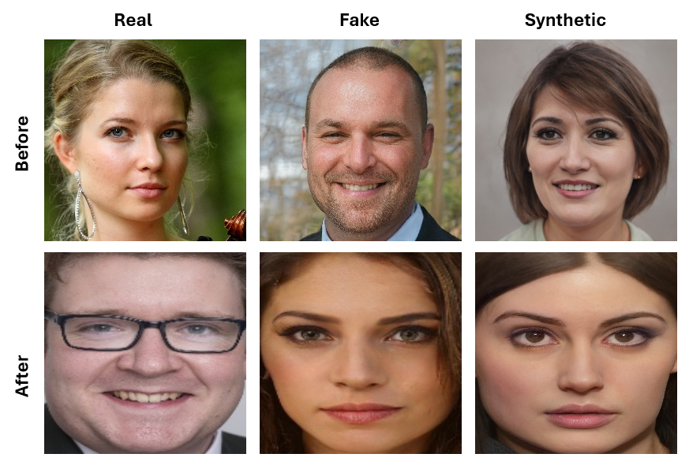

## Real vs Fake vs Synthetic Faces

<div align="center">
    
    <p></p>
</div>

<div align="center">
    <a href="https://github.com/snaeemm/RFS/issues">
        
    </a>
    <a href="https://github.com/snaeemm/RFS/network/members">
        
    </a>
    <a href="https://github.com/snaeemm/RFS/stargazers">
        
    </a>
    <a href="https://github.com/snaeemm/RFS/blob/master/LICENSE">
        
    </a>
    <a href="http://dx.doi.org/10.1109/fg59268.2024.10581973">
        
    </a>
</div>

This is the official repository for the paper 
[Real, fake and synthetic faces - does the coin have three sides?](https://ieeexplore.ieee.org/document/10581973).

## Abstract
With the ever-growing power of generative artificial
intelligence, deepfake and artificially generated (synthetic)
media have continued to spread online, which creates various
ethical and moral concerns regarding their usage. To tackle this,
we thus present a novel exploration of the trends and patterns
observed in real, deepfake and synthetic facial images. The
proposed analysis is done in two parts: firstly, we incorporate
eight deep learning models and analyze their performances
in distinguishing between the three classes of images. Next,
we look to further delve into the similarities and differences
between these three sets of images by investigating their image
properties both in the context of the entire image as well as in
the context of specific regions within the image. ANOVA test
was also performed and provided further clarity amongst the
patterns associated between the images of the three classes.
From our findings, we observe that the investigated deeplearning
models found it easier to detect synthetic facial images,
with the ViT Patch-16 model performing best on this task with
a class-averaged sensitivity, specificity, precision, and accuracy
of 97.37%, 98.69%, 97.48%, and 98.25%, respectively. This
observation was supported by further analysis of various image
properties. We saw noticeable differences across the three
category of images. This analysis can help us build better
algorithms for facial image generation, and also shows that
synthetic, deepfake and real face images are indeed three
different classes.

## Dataset

### Download

### Metadata Structure

## License

The dataset is under the [EULA](eula.pdf). You need to agree and sign the EULA to access the dataset.

The other parts of this project is under the CC BY-NC 4.0 license. See [LICENSE](LICENSE) for details.

## References

If you find this work useful in your research, please cite it.

```bibtex
@INPROCEEDINGS{10581973,
  author={Naeem, Shahzeb and Al-Sharawi, Ramzi and Khan, M. Riyyan and Tariq, Usman and Dhall, Abhinav and Al Nashash, Hasan},
  booktitle={2024 IEEE 18th International Conference on Automatic Face and Gesture Recognition (FG)}, 
  title={Real, Fake and Synthetic Faces - Does the Coin Have Three Sides?}, 
  year={2024},
  volume={},
  number={},
  pages={1-10},
  keywords={Deep learning;Deepfakes;Ethics;Analytical models;Accuracy;Sensitivity;Generative AI},
  doi={10.1109/FG59268.2024.10581973}}
}
```
